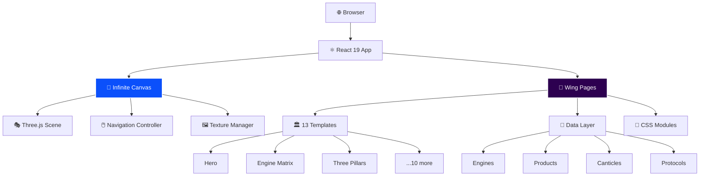

<!-- readme-gen:start:hero -->
<div align="center">


</div>
<!-- readme-gen:end:hero -->

<!-- readme-gen:start:badges -->
<p align="center">
  
  
  
  
  
</p>

<p align="center">
  
  
  
</p>
<!-- readme-gen:end:badges -->

<!-- readme-gen:start:tech-stack -->
<p align="center">
  
  <br />
  
</p>
<!-- readme-gen:end:tech-stack -->

---

> **An immersive web experience exploring consciousness architecture through 13 interconnected wings.** Each wing is a bespoke, full-viewport interactive page featuring modals, data visualizations, and keyboard-driven navigation — all rendered on an infinite 3D canvas built with React 19, Three.js, and TypeScript.

<!-- readme-gen:start:divider -->

<!-- readme-gen:end:divider -->

## ✨ The 13 Wings

<table>
<tr>
<td width="33%" valign="top">

### 🌌 Hero (00)
Entry point with sovereignty-first donation modal and sacred geometry backdrop.

### 🧠 Engine Matrix (01) 
16 canonical engines in a 4×4 grid with compass directions (STABILIZE/HEAL/CREATE/MUTATE).

### 🏛️ Three Pillars (02)
Kha-Ba-La framework deep dives — Vedic Intelligence, Western Precision, Biofield & Sonic.

### 📊 Financial Biosensor (03)
Bloomberg-terminal-inspired data visualization with Tattva cycle decision windows.

### 🌀 Regenerative Field (04)
Kha-Ba-La coherence triad expansion with biofield mapping.

</td>
<td width="33%" valign="top">

### 👥 Witness Agents (05)
Dual-lane hover interaction: **Pichet** (Structure) ↔ **Aletheos** (Flow).

### 📖 Somatic Canticles (06)
27-chapter trilogy browser with biorhythm-synchronized chapter previews.

### 🧭 Infinite Treasure (07)
Compass rose navigation with Purushartha quadrant drill-down (Dharma/Artha/Kama/Moksha).

### ⚗️ Apothecary (08)
6 ritual product categories with engine-matched physical artifacts.

</td>
<td width="33%" valign="top">

### 🖥️ Workspace TUI (09)
Terminal launch modal with copy-to-clipboard install commands.

### ⚡ First Rule (10)
Glitch → awakening toggle transition with shattered panel layout.

### 🔮 Init Protocol (11)
16 micro-rituals across 4 spins (Entry/Cultivation/Integration/Independence).

### 🚀 Begin Journey (12)
3 external access points: Selemene API, Somatic Canticles, Noesis TUI.

</td>
</tr>
</table>

<!-- readme-gen:start:divider -->

<!-- readme-gen:end:divider -->

## 🚀 Quick Start

```bash
# Clone the repository
git clone https://github.com/Sheshiyer/14113-X-vault.git
cd infinite-canvas

# Install dependencies
npm install

# Start development server
npm run dev
```

Open `http://localhost:5173` — navigate the infinite canvas and click any wing to enter its page.

<!-- readme-gen:start:divider -->

<!-- readme-gen:end:divider -->

## 🏗️ Architecture



<!-- readme-gen:start:divider -->

<!-- readme-gen:end:divider -->

## 📁 Project Structure

```
📦 infinite-canvas
├── 📂 src/
│   ├── 📂 app/                    # Shell: command palette, linear mode, terminal egg
│   ├── 📂 components/             # Shared: Modal, LoadingSkeleton
│   ├── 📂 data/                   # Canonical data
│   │   ├── 📄 engines.ts          # 16 symbolic-computational engines
│   │   ├── 📄 products.ts         # 6 apothecary products
│   │   ├── 📄 canticles.ts        # 27-chapter trilogy
│   │   └── 📄 protocols.ts        # 16 initiation protocols
│   ├── 📂 infinite-canvas/        # Three.js scene, texture manager, constants
│   ├── 📂 wing-page/
│   │   ├── 📄 data.ts             # WingData type + 13 wing definitions
│   │   ├── 📄 index.tsx           # Router: slug → lazy-loaded template
│   │   ├── 📂 components/         # ProgressiveImage, LoadingSkeleton
│   │   └── 📂 templates/          # 13 bespoke templates (.tsx + .module.css)
│   ├── 📄 index.css               # CSS custom properties (Goethe palette)
│   └── 📄 index.tsx               # App entry point
├── 📂 public/
│   ├── 📂 images/                 # Wing artwork, products, books, agents
│   └── 📂 artworks/               # Canvas textures
├── 📂 tests/                      # Playwright visual regression
├── 📄 package.json
├── 📄 vite.config.ts
└── 📄 tsconfig.json
```

<!-- readme-gen:start:divider -->

<!-- readme-gen:end:divider -->

## 🎨 Design System

### Brand Tokens (Goethe Palette)

| Token | Hex | Usage |
|:------|:---:|:------|
| `--color-void-black` | `#070B1D` | Primary background |
| `--color-witness-violet` | `#2D0050` | Accent, esoteric elements |
| `--color-flow-indigo` | `#0B50FB` | Links, interactive highlights |
| `--color-sacred-gold` | `#C5A017` | Headings, emphasis |
| `--color-coherence-emerald` | `#10B5A7` | Success states, coherence |
| `--color-parchment` | `#f0ede3` | Body text on dark backgrounds |
| `--color-muted-silver` | `#8a9ba8` | Secondary text, metadata |

<!-- readme-gen:start:divider -->

<!-- readme-gen:end:divider -->

## 📊 Project Health

| Category | Status | Score |
|:---------|:------:|------:|
| Type Safety | ████████████████████ | 100% |
| Code Quality | █████████████████░░░ | 90% |
| Testing | ██████████████░░░░░░ | 70% |
| Documentation | ████████████████░░░░ | 80% |
| Accessibility | ████████████████████ | 100% |

> **Overall: 88%** — Excellent

### Quality Metrics

- ✅ **Strict TypeScript** — Strict mode enabled, no `any` types
- ✅ **Biome Linting** — Error-level diagnostics enforced
- ✅ **WCAG AA** — Color contrast ≥4.5:1, keyboard navigation, ARIA labels
- ✅ **Code Splitting** — Lazy-loaded templates via `React.lazy()` + Suspense
- ✅ **Visual Regression** — Playwright tests for all 13 wings
- 🔄 **CI/CD** — Ready for GitHub Actions (not yet configured)

<!-- readme-gen:start:divider -->

<!-- readme-gen:end:divider -->

## 🛠️ Development

### Available Scripts

```bash
npm run dev              # Start dev server (localhost:5173)
npm run build            # Production build to dist/
npm run preview          # Preview production build
npm run lint             # Biome lint check
npm run format           # Biome format with write
npm run check            # Type check + lint
npm run test:visual      # Playwright visual regression tests
npm run test:visual:up   # Update visual baselines
```

### Key Dependencies

| Package | Version | Purpose |
|:--------|:-------:|:--------|
| `react` | ^19.2.3 | UI library with concurrent features |
| `@react-three/fiber` | 9.4.2 | React renderer for Three.js |
| `@react-three/drei` | 10.7.7 | Useful helpers for R3F |
| `three` | 0.182.0 | 3D graphics library |
| `gsap` | 3.14.2 | Animation library |
| `@biomejs/biome` | 2.3.8 | Linting and formatting |
| `@playwright/test` | 1.58.2 | Visual regression testing |

<!-- readme-gen:start:divider -->

<!-- readme-gen:end:divider -->

## 🧪 Testing

Visual regression tests are powered by **Playwright**:

```bash
# Run all visual tests
npm run test:visual

# Update baselines after intentional UI changes
npm run test:visual:up
```

Tests cover all 13 wing pages with screenshot comparisons.

<!-- readme-gen:start:divider -->

<!-- readme-gen:end:divider -->

## 🚢 Deployment

The project builds to a static `dist/` directory:

```bash
npm run build
```

Deploy to any static hosting (Vercel, Netlify, GitHub Pages, etc.).

<!-- readme-gen:start:divider -->

<!-- readme-gen:end:divider -->

## 🤝 Contributing

1. Fork the repository
2. Create your feature branch (`git checkout -b feature/amazing-feature`)
3. Run checks (`npm run check`)
4. Commit your changes (`git commit -m 'feat: add amazing feature'`)
5. Push to the branch (`git push origin feature/amazing-feature`)
6. Open a Pull Request

### Code Standards

- **TypeScript**: Strict mode, explicit return types on exports
- **CSS**: CSS Modules with design tokens, no hardcoded colors
- **Components**: Functional with hooks, memoized where beneficial
- **Accessibility**: WCAG AA compliance required (keyboard nav, ARIA, contrast)

<!-- readme-gen:start:divider -->

<!-- readme-gen:end:divider -->

## 🙏 Credits

Infinite canvas foundation by [Edoardo Lunardi](https://github.com/edoardolunardi) via [Codrops](https://tympanus.net/codrops/?p=106679). Adapted and extended for the Tryambakam Noesis consciousness architecture.

<!-- readme-gen:start:footer -->
<div align="center">


**Built with 💜 by [Contributors](https://github.com/Sheshiyer/14113-X-vault/graphs/contributors)**

[MIT License](LICENSE) · [Report Issue](https://github.com/Sheshiyer/14113-X-vault/issues)

</div>
<!-- readme-gen:end:footer -->
